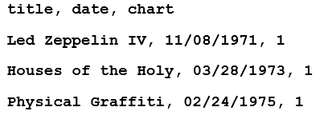
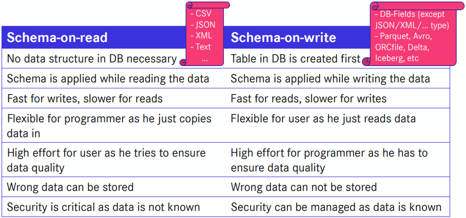

# Parquet

Hello and Welcome!

This Katacoda covers the basics of Parquet and demonstrates it as an example data format for schema-on-write.
But first of all, it is important to understand what Parquet actually is.

> Parquet ist an open source, column-oriented data file format, meaning that, unlike in row-oriented data file formats like CSV, files are organized by column, rather than by row. [1](https://databricks.com/de/glossary/what-is-parquet)

The following illustrations depict what a row- and column-oriented data file format essentially look like.

The first illustration shows a row-oriented format, which is similar to a table - the column names are written into the first row, and every row that follows afterwards contains data at the corresponding column.

The second illustration shows how the same dataset could be stored in a column-oriented format - each row contains a column name and every single piece of data inside of that column.

Storing data in this manner, which is implemented within Parquet, introduces a number of advantages, some of which are the following:

- Efficiency: When querying columnar storage, you can skip over the non-relevant data very quickly, which makes aggregation queries less time-consuming compared to row-oriented databases.
- Compression: Parquet and similar column-oriented formats are built to support flexible compression options and efficient encoding schemes.

# Schema-on-read and schema-on-write [2](https://www.marklogic.com/blog/schema-on-read-vs-schema-on-write/)

That leaves us with the term "schema-on-write".
Let's assume that you were assigned with creating a database which is meant to store user data of your company's web site.
Typically, a database like this would include columns such as:

- Username
- E-Mail address
- Password (encrypted)
- ...

Conventionally, you would write down every column that is needed on a piece of paper, and then, once you are certain that you thought of everything, you would construct that schema in your database.
This means that the database's schema is pre-defined.
Writing new data will have to follow that schema in order for the database management system to correctly handle it.
Similarly, reading existing data will always return data that follows the pre-defined schema.
This approach is known as "schema-on-read", and has been a conventional approach to construct databases for decades.
However, this is not the only approach.

That's where "schema-on-write" comes into the equation.
With schema-on-write, a different sequence is followed, whereby the data is just loaded as-is.
When reading the data, a unique lens could be applied, thus making it possible to retrieve data in a schema that suits your needs.

As both of these approaches include their own range of pros and cons, neither can be called the "better" approach.
> Depending on the situation and on what outcome is deemed desirable, either approach could prove itself the more suited one.
Some of the pros and cons:

---

This katacoda will interactively cover how Parquet can be used as a data file format to implement a schema-on-write solution.
To create and explain the code iteratively, a Jupyter Notebook will be used.
Let's get started by installing that!

